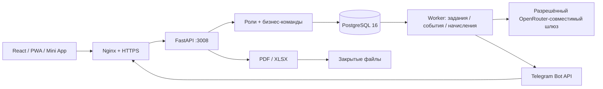

# Car City / EliteCar Concept

Независимый демонстрационный продукт для вакансии ELITE CAR. Все люди, автомобили с конкретными идентификаторами, договоры и операции вымышлены. Приложение не принимает реальные заказы и не выполняет банковские списания.

**Стенд:** https://elite-car.shvarev-demo.ru · **OpenAPI:** https://elite-car.shvarev-demo.ru/api/docs

**Новый контур «Под капотом»:** https://elite-car.shvarev-demo.ru/#under — гибридный RAG, агент с инструментами, четыре реальных процесса n8n на учебных источниках, сверка и журнал. Архитектура, эксплуатация и отклонения от первоначальных оценок: [docs/UNDER-HOOD.md](docs/UNDER-HOOD.md).

## Запуск на сервере

Рабочая директория `/var/www/elite-car`, пользователь ОС `elitecar`, БД и роль PostgreSQL `elite_car`. Секреты в `/etc/elite-car.env`, root:elitecar, 0640. Файлы в `/var/lib/elite-car/files`, вне nginx root. Порт API 127.0.0.1:3008.

```bash
cd /var/www/elite-car
source .venv/bin/activate
alembic upgrade head
pm2 startOrReload ecosystem.config.cjs --update-env
curl https://elite-car.shvarev-demo.ru/api/health
```

Vite используется для разработки, `npm run dev`. На общем сервере Rollup превышал доступную память; production-сборка выполняется esbuild после проверки TypeScript. Это осознанное изменение первоначального плана. CSS — Tailwind Preflight и собственная адаптивная система. `npm run build` не требует временного swap. Файл `scripts/deploy.sh` предназначен для первого подключения nginx/HTTPS; повторные релизы не должны перезаписывать действующий TLS-конфиг.

## Архитектура



Модульный монолит. `app/domain.py` содержит команды; HTTP и Telegram вызывают одну бизнес-логику. `Space` — пространство посетителя; `Item` — типизированный по `kind` объект с JSONB-полями и версией. `Booking` имеет PostgreSQL GiST EXCLUDE по пересечению временных диапазонов. `Entry` хранит Decimal/Numeric; деньги в JSON передаются строками. `Event`, `Receipt`, `Job`, `Usage` — аудит, идемпотентность, очередь, бюджет модели. Модель сознательно компактная; перед подключением реальных систем целесообразно разнести поля договоров и участников по отдельным таблицам.

Сессия — случайный токен в Secure HttpOnly SameSite cookie; в БД только SHA-256. Срок — 24 часа после активности. Роль можно менять только в своей сессии. Это режим демонстрации, не способ аутентификации сотрудников в реальном бизнесе. Все запросы ограничены пространством. Команды проверяют роль, доступ к объекту, статус и при передаче — версию. Изменение, аудит и исходящее задание фиксируются в одной транзакции. SSE передаёт события только в пределах роли и пространства.

## Реализованные процессы

| Процесс | Последовательность |
|---|---|
| Такси | Клиент → комплект документов → проверка → резерв → подтверждение → выдача → начисления → обращение / возврат |
| Прокат | Даты и доступность → бронь → выдача с залогом → продление → возврат, перерасчёт срока и километров → освобождение / удержание залога |
| Выкуп | Индивидуальный договор → календарь → частичная оплата → каникулы → утверждённый расчёт закрытия → погашение долга → финальная оплата → передача |
| Владельцы | Автомобили в управлении → смета владельцу → ремонт → месячный отчёт → утверждение → регистрация выплаты |
| Сервис | Обращение → смета → согласование → ремонт → расход → контрольный осмотр → возврат в эксплуатацию |
| Финансы | Ручной платёж / CSV / XLSX → предпросмотр → дедупликация → сверка → журнал → отчёт; исправления через сторно |

Доступность рассчитывается backend. Время брони — полуоткрытый интервал, выдача в 10:00 МСК; резерв действует 30 минут. Физическая готовность отделена от бронирования. Запись «готов» сама по себе не означает «свободен». Нельзя выдать автомобиль в ремонте или до контрольного осмотра. Фото привязываются к осмотрам и обращениям.

160 автомобилей: 60 такси, 50 прокат, 20 коммерческие, 30 выкуп. 24 прокатных автомобиля принадлежат сторонним владельцам. История охватывает 90 дней; даты пересчитываются при создании сессии. Идентификаторы и операции между посетителями не пересекаются. Большой набор 4000 автомобилей создаётся только отдельным проверочным скриптом и удаляется после замера.

## Карта доступа

| Роль | Чтение / действия |
|---|---|
| Водитель | Свои договоры, автомобили, начисления, платежи и обращения; документы, каникулы, график, обращение |
| Клиент | Свои договоры и расчёты, каталог проката, бронь, обращение |
| Менеджер | Клиенты, договоры, автомобили, выдача/возврат и перемещения; без финансового журнала |
| Проверка | Клиенты и комплект документов, мотивированное решение |
| Сервис | Автомобили, осмотры, обращения и ремонт; без финансового журнала |
| Финансист | Начисления, платежи, сторно, залоги, периоды, сверка и выплаты владельцам |
| Владелец авто | Только свои автомобили, сметы, отчёты и операции; согласование своих смет |
| Собственник / администратор | Полный доступ внутри своего демонстрационного пространства |

## Расчёты и допущения

* В такси базовый график 7/0; коэффициенты 6/1 — 1,17, 5/2 — 1,40. Бесплатный первый день только у такси; акции не суммируются. Выходные определяются календарной неделей МСК. Каникулы — отдельное утверждённое освобождение.
* Прокат оплачивается каждый день. Конечная дата календаря исключается. При возврате учитывается фактическая длительность с двухчасовым допуском: ровно 26 часов — одни сутки, 26 часов и 1 секунда — двое. Демотариф по сроку: 7+ дней −5%, 30+ −10%; ставка фиксируется при создании договора.
* Демозалог 20 000 ₽, лимит 250 км/сутки, перепробег 30 ₽/км. Эти числа — учебные параметры конкретного договора, не публичная оферта работодателя.
* Залог — обязательство, не доход. Удержание требует основания и роли финансиста. Превысить остаток залога нельзя.
* Выкуп не имитирует кредит: остаток — календарь обязательств. Досрочный расчёт утверждает финансист. Передача блокируется при текущей задолженности.
* Поступления отличаются от начислений. Возраст долга рассчитывается на конец периода, по FIFO с учётом корректировок. Расходы и бонусы уменьшают результат. Прямой результат и результат после общих расходов показываются отдельно.
* Общие расходы распределяются по доступным автомобиледням группы за вычетом записанного простоя. Фильтры показывают уже распределённую долю. Округление корректируется последней строкой, чтобы итоги совпадали.
* Расчёт владельцу: арендные поступления × 70% − расходы либо поступления × 50% − половина расходов. Залоги исключены. Убыток одного автомобиля уменьшает общую выплату владельцу; выплачиваемая сумма сверяется с итогом отчёта.
* Страховое возмещение в демонстрации отражено как ожидаемое требование и не включено в фактически полученные деньги.
* Закрытый месяц запрещает новые проводки в него. Сторно текущей датой не переписывает исходную запись.

## AI

Агент с шестью ограниченными инструментами, гибридный поиск по регламентам, структурирование обращения, объяснение рассчитанных финансов и извлечение полей документа. Поиск: локальный MiniLM (384 измерения), pgvector + русский FTS, слияние RRF. Ответ содержит проверяемые ссылки на найденные фрагменты и версии документов. Проверка наличия цитаты не доказывает истинность каждого утверждения модели. Расчёты выполняет Python/SQL. Модель не получает инструменты изменения финансов. Текст документов считается данными, не инструкциями.

Перед запросом резервируется верхняя оценка стоимости в PostgreSQL под advisory lock. Общий лимит приложения $0.50/сутки МСК; публичная сессия — 10 заданий/час. Учёт расходов переживает удаление сессии. Неопределённо завершившийся платный запрос автоматически не повторяется. Неудачные ответы не заменяются подготовленным текстом.

Настроенные кандидаты сравниваются по стоимости; выбирается самая дешёвая, прошедшая 60 проверок с порогом 90% и всеми критичными отказами. Результаты: `reports/ai-evaluation.json`, краткая сводка также в настройках. Набор — функциональная проверка демонстрации, не доказательство отсутствия всех ошибок LLM. Единственный неуспех первого завершённого прогона: неоднозначность слова «вариант 2» в вопросе о доле владельца (модель выбрала схему 50/50 вместо ожидавшегося упоминания 70/30).

Параметры reasoning сверены с [документацией OpenRouter](https://github.com/OpenRouterTeam/docs/blob/main/guides/best-practices/reasoning-tokens.mdx). Финальные ответы ограничены по длине. Для сканированного PDF без текстового слоя интерфейс предлагает загрузить страницу PNG/JPEG.

## Telegram

Отдельный бот подключён: [@elitecar_demo_bot](https://t.me/elitecar_demo_bot). Код не использует официальный бот компании или ботов соседних проектов. Настройка:

```bash
cd /var/www/elite-car
PYTHONPATH=. .venv/bin/python scripts/connect_telegram.py /root/path-to-token
pm2 restart demo-elite-car-api demo-elite-car-worker
```

Команды `/start`, `/balance`, `/car`, `/tickets`, `/documents`, `/role driver|client|manager`. Свободный текст обрабатывает агент: баланс читает из учёта, правила ищет в базе знаний, обращение готовит как черновик. Запись появляется только после отдельного подтверждения; повторное нажатие не создаёт дубль. Фото и явная кнопка обращения работают через обычный сценарий; документы формируются из своего договора. Mini App проверяет HMAC и давность 10 минут. Ссылка связывания одноразовая, 10 минут. Webhook проверяет секрет и дедуплицирует update_id. Только приватные чаты; исходящее уведомление требует предварительного запуска/связывания бота. Отправка уведомлений имеет семантику «как минимум один раз» при неоднозначном сетевом сбое; бизнес-действие защищено ключом идемпотентности.

## Проверки

```bash
.venv/bin/python -m pytest -q tests/test_domain.py
npm run test:e2e
PYTHONPATH=. .venv/bin/python scripts/eval_ai.py
PYTHONPATH=. .venv/bin/python scripts/load_check.py
bash scripts/restore_check.sh
```

Прогоны AI и нагрузки выполняются раздельно со сборкой. `reports/` содержит результаты и скриншоты desktop/mobile. `scripts/eval_ai.py` использует тот же ограничитель расходов, что приложение. Расширение тестовой матрицы обязательно перед подключением реальных персональных данных и финансовых интеграций.

## Эксплуатация, резервирование, откат

`/api/health` проверяет БД, heartbeat worker и очередь. PM2 перезапускает API/worker при сбое и превышении памяти. Nginx и PM2 ведут журналы. Worker восстанавливает просроченные аренды заданий; ошибочное задание повторяется до трёх раз, кроме неоднозначного AI-вызова.

`scripts/backup.sh` создаёт pg_dump custom + архив документов + SHA-256. Cron ежедневно в 01:20 времени сервера, хранение семь дней. Это локальные копии; для защиты от потери сервера нужен внешний закрытый storage пользователя. Секреты не попадают в архив приложения. `restore_check.sh` восстанавливает копию в отдельную временную БД, сверяет число проводок и файлы, удаляет только свои тестовые ресурсы.

`scripts/release.sh` перед миграциями сохраняет БД и версию приложения в `releases/<UTC-время>`. Для отката сначала остановить только процессы EliteCar, вернуть `app/` и `dist/` из нужной версии, затем проверить совместимость миграций. Не откатывать БД поверх новых пользовательских данных без отдельного решения; миграции этого демо добавочные. После отката выполнить health-check и основной браузерный сценарий.

## Граница демонстрации

Реальные провайдеры: AI, PDF/XLSX, Telegram, n8n. Учётная система, банк и агрегатор поездок не подключены к работодателю; загрузка выписки — действующий файловый адаптер с синтетическими данными. Электронная подпись, банковские транзакции, OCR юридически значимых документов и реальная телеметрия отсутствуют. Карта показывает площадки схематически и не изображает движение автомобилей.

Это содержательный прототип, а не готовый промышленный сервис работодателя. До реального внедрения нужны SSO/приглашения сотрудников, договорная и правовая проверка тарифов, нормализация персональных данных, внешние резервные копии, договоры с провайдерами и интеграционные контракты. В `docs/DEMO.md` — сценарий показа и точная карта ограничений демонстрационного релиза.
